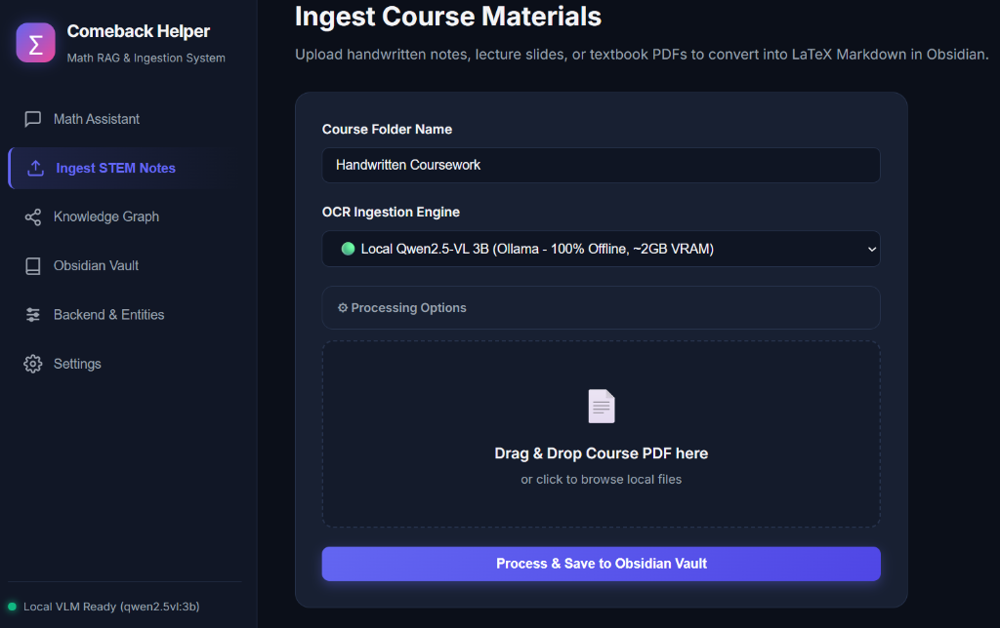
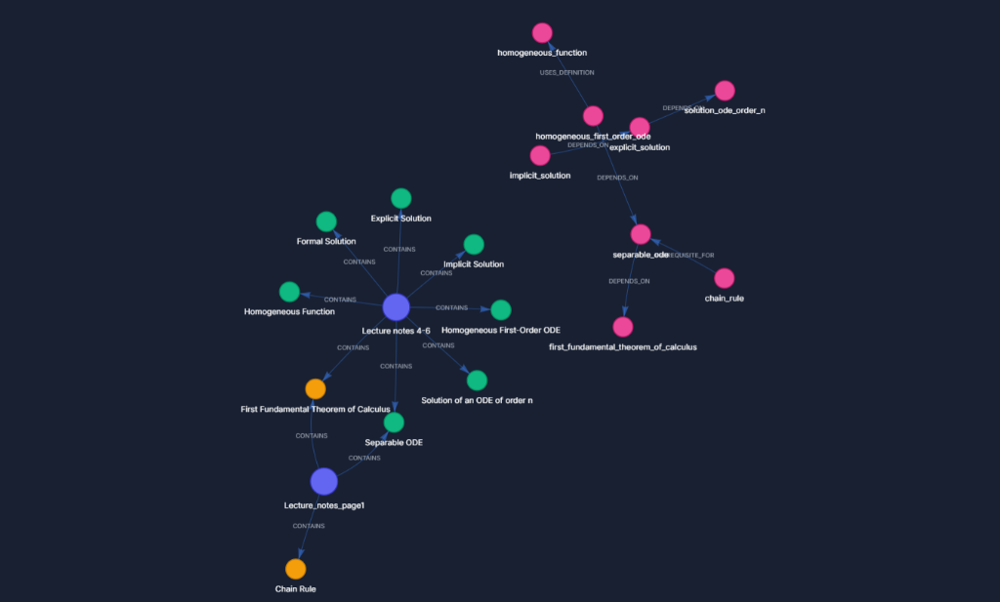

<div align="center">

# 🧠 Comeback Helper

**Local RAG & Knowledge Graph Engine for Mathematics & Technical Coursework**

[](https://python.org)
[](https://fastapi.tiangolo.com)
[](https://lancedb.com)
[](LICENSE)

*Ingest handwritten notes & PDFs → Build a Math Knowledge Graph → Query with Hybrid RAG*

</div>

---

## What is this?

Comeback Helper is a study assistant for math-heavy and technical coursework. Drop in your lecture PDFs (typed or handwritten), and it will:

1. **OCR & Parse** — Convert pages into clean LaTeX Markdown using Gemini Vision or a local Qwen2.5-VL model
2. **Build a Knowledge Graph** — Extract math concepts, theorems, definitions, and their prerequisite relationships
3. **Index for Search** — Embed chunks into a local LanceDB vector store with math-aware chunking
4. **Answer Questions** — Hybrid RAG combines vector similarity + graph traversal + Gemini synthesis

Everything runs locally except Gemini API calls. Your notes stay on your machine.

<br>

<div align="center">
  
  <p><i>STEM Coursework Ingestion Dashboard with local 100% offline Qwen2.5-VL OCR engine and Obsidian vault integration.</i></p>
  <br>
  
  <p><i>Interactive Visual Knowledge Graph Dashboard showing entity prerequisite links, course nodes, and math concepts.</i></p>
</div>

---

## Architecture

```
 ┌──────────────────┐     ┌──────────────────────────┐     ┌──────────────────────────────┐
 │  Coursework PDF  │ ──► │ Ingestion Pipeline       │ ──► │ Markdown Vault Note          │
 │  (Handwritten)   │     │ (Gemini / Qwen2.5-VL)    │     │ (LaTeX Math Preservation)    │
 └──────────────────┘     └──────────────────────────┘     └──────────────────────────────┘
                                     │                                   │
                                     ▼                                   ▼
                          ┌──────────────────────────┐     ┌──────────────────────────────┐
                          │ Math PropertyGraph       │     │ LanceDB Vector Store         │
                          │ (NetworkX PropertyGraph) │     │ (FastEmbed + BM25 FTS)       │
                          └──────────────────────────┘     └──────────────────────────────┘
                                     │                                   │
                                     └───────────────┬──────────────────┘
                                                     ▼
                                         ┌───────────────────────────┐
                                         │ Unified FastAPI Server    │
                                         │ (:8000 Async Backend)     │
                                         └───────────────────────────┘
                                                     │
                                                     ▼
                                         ┌───────────────────────────┐
                                         │ Vis.js Dashboard & Web UI │
                                         │ (KaTeX + Graph Visualizer)│
                                         └───────────────────────────┘
```

---

## Features

| Feature | Details |
|---------|---------|
| **Unified FastAPI Server** | High-performance async server (`:8000`) serving UI dashboard, vault API, graph indexer, and RAG synthesis |
| **Handwriting OCR** | Google Gemini Vision or 100% local Qwen2.5-VL (3B) via Ollama (~2 GB VRAM) |
| **Math PropertyGraph** | 3-tier extraction cascade → typed nodes (`Theorem`, `Definition`, `Proof`, `Formula`) with directed edges (`DEPENDS_ON`, `PROVES`, `PREREQUISITE_FOR`) |
| **Local Vector & BM25 Search** | LanceDB + FastEmbed with native BM25 hybrid search, CUDA GPU acceleration, and course-scoped filtering |
| **Math-Aware Chunking** | Splits on page markers → headings → paragraphs while preserving `$$...$$` blocks intact with overlap for theorem→proof continuity |
| **Hybrid RAG** | Combines vector similarity + semantic graph node matching + Gemini synthesis with tunable top-K, temperature, and course scope |
| **Interactive Dashboard** | Vis.js knowledge graph with entity type/course filters, retrieval settings panel, and KaTeX math rendering |
| **Obsidian Compatible** | Notes saved as standard Markdown with YAML frontmatter and `[[wikilinks]]` |

---

## Quick Start

### 1. Clone & Install

```bash
git clone https://github.com/your-username/comeback-helper.git
cd comeback-helper
python -m venv .venv
.venv\Scripts\activate   # Windows
pip install -r requirements.txt
```

### 2. Configure

Copy `.env.example` to `.env` and add your Gemini API key:

```ini
GEMINI_API_KEY=your_key_here
GEMINI_MODEL=gemini-flash-latest
OCR_PROVIDER=gemini
OBSIDIAN_VAULT_LOCATION=./.storage/vault
STORAGE_DIR=./.storage
```

### 3. Run

```bash
python -m src.server
```

Open **http://127.0.0.1:8000** — you're ready to go.

---

## API Reference

| Endpoint | Method | Description |
|----------|--------|-------------|
| `/api/ingest` | `POST` | Upload PDF, run OCR, save to vault, index into graph & vectors |
| `/api/query` | `POST` | Hybrid RAG query with configurable top-K, temperature, course filter |
| `/api/vault` | `GET` | List all courses and notes in the vault |
| `/api/graph` | `GET` | Get knowledge graph nodes & edges as JSON |
| `/api/courses` | `GET` | List available course names |
| `/api/settings` | `GET` | System config, index stats |
| `/api/rebuild/graph` | `POST` | Re-index all vault notes into the knowledge graph |
| `/api/rebuild/vectors` | `POST` | Re-embed all vault notes into the vector store |
| `/api/health/ollama` | `GET` | Local Ollama service & model health check |

Full API docs available at **http://127.0.0.1:8000/docs** (auto-generated Swagger UI).

---

## Project Structure

```
comeback_helper/
├── src/
│   ├── server.py            # FastAPI app with lifespan singletons
│   ├── config.py            # Pydantic settings (.env driven)
│   ├── logger.py            # Loguru centralized logging
│   ├── cli.py               # Click CLI (ingest, query)
│   ├── chunker.py           # Math-aware Markdown chunking
│   ├── llm/                 # Centralized LLM clients
│   │   ├── gemini.py        # Gemini client singleton
│   │   └── ollama.py        # Ollama client (text + vision + health)
│   ├── ingestion/           # OCR providers & pipeline
│   │   ├── pipeline.py      # PDF → page images → OCR → vault
│   │   ├── gemini_ocr.py    # Google Gemini Vision provider
│   │   ├── handwriting_provider.py
│   │   └── handwriting/     # Local Qwen VLM pipeline
│   ├── graph/               # Knowledge graph
│   │   ├── schema.py        # Pydantic entity/relation models
│   │   └── indexer.py       # 3-tier extraction → NetworkX
│   ├── vector/
│   │   └── store.py         # LanceDB + FastEmbed store
│   ├── retrieval/
│   │   └── engine.py        # Hybrid RAG engine
│   └── vault/
│       ├── manager.py       # Vault file & wikilink parsing
│       └── state.py         # SHA-256 incremental change tracker
├── static/                  # Web dashboard (HTML/JS/CSS)
├── tests/                   # Unit tests
├── docs/                    # Public documentation
├── private_docs/            # Internal architecture & test reports
└── requirements.txt
```

---

## Configuration Options

All settings are read from `.env` via Pydantic:

| Variable | Default | Description |
|----------|---------|-------------|
| `GEMINI_API_KEY` | *required* | Google AI Studio API key |
| `GEMINI_MODEL` | `gemini-flash-latest` | Model for OCR and RAG synthesis |
| `OCR_PROVIDER` | `gemini` | `gemini`, `marker`, `handwriting`, or `local` |
| `OBSIDIAN_VAULT_LOCATION` | `./.storage/vault` | Path to Obsidian vault directory |
| `STORAGE_DIR` | `./.storage` | Path for graph, vector DB, logs |
| `EMBED_MODEL` | `BAAI/bge-small-en-v1.5` | FastEmbed model for vector embeddings |

---

## Testing

```bash
# Unit tests
python -m pytest tests/

# Or with unittest
python -m unittest discover -s tests
```

---

## License

[Apache License 2.0](LICENSE)
