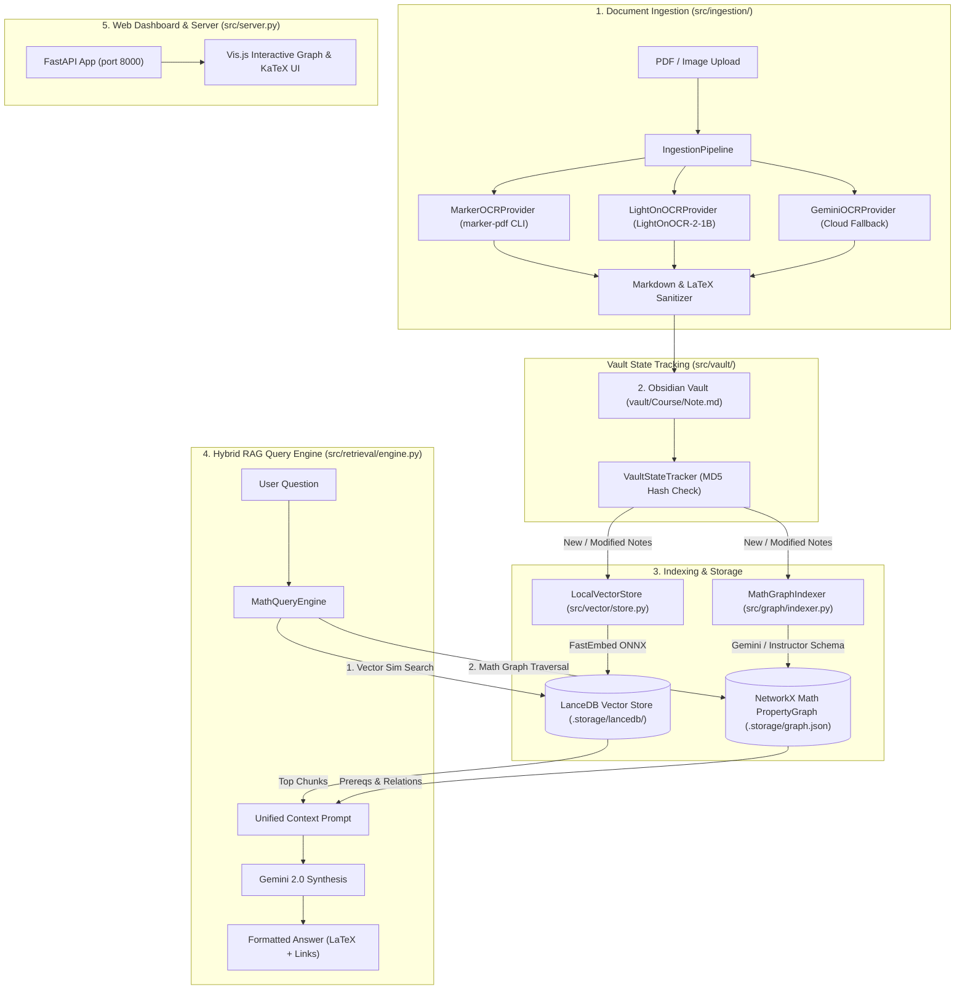

# Comeback Helper: Architecture, Vector/RAG Maintenance & Local Handwritten Notes Pipeline

## 🎯 Overview
This document details the complete system architecture of **Comeback Helper**, explaining how vectors and Knowledge Graph RAG are maintained, and outlines a multi-step local pipeline for converting handwritten notes into structured Obsidian Markdown.

---

## 🏗️ 1. Repository Architecture & Workflow

**Comeback Helper** is a local-first study assistant designed for STEM and math-heavy coursework. It ingests academic PDFs/notes, cleans LaTeX formulas, writes Markdown notes to an Obsidian Vault, builds an interactive Math PropertyGraph, and embeds text chunks into LanceDB for hybrid RAG search.

### 🔄 End-to-End System Flow



---

## 📦 2. Component Deep Dive

### 1. Ingestion Layer (`src/ingestion/`)
* **`pipeline.py`:** Orchestrates PDF page rendering via PyMuPDF (`fitz`), routes pages to the active OCR provider, sanitizes output, and streams appended notes incrementally to target course subfolders in `vault/CourseName/Note.md`.
* **Providers:**
  * **`marker_provider.py`:** Runs local `marker-pdf` CLI for fast PDF layout parsing and LaTeX formula extraction.
  * **`local_ocr.py`:** Offline VLM provider running `LightOnOCR-2-1B` via HuggingFace Transformers with explicit CUDA memory clearing.
  * **`gemini_ocr.py`:** Cloud fallback via Gemini Vision API.
* **`sanitizer.py`:** Cleans up raw OCR text, normalizes inline (`$...$`) and block (`$$...$$`) LaTeX syntax.

### 2. Vault Management & Incremental State (`src/vault/`)
* **`manager.py`:** Reads Obsidian note files, manages YAML frontmatter (`course`, `source_file`, `tags`), and parses Obsidian `[[wikilinks]]`.
* **`state.py`:** Computes MD5 hashes per file stored in `.storage/vault_state.json` so indexing stages only process new/modified notes.

### 3. Vector Storage & RAG Maintenance (`src/vector/store.py`)
* **Storage Engine:** Embedded **LanceDB** database located at `.storage/lancedb/` (serverless, disk-backed Rust vector store).
* **Embedding Model:** **FastEmbed** (`BAAI/bge-small-en-v1.5`), executed locally using ONNX Runtime with CUDA GPU acceleration (and CPU fallback).
* **Vector Maintenance Workflow:**
  1. Notes in the Obsidian Vault are split into text chunks.
  2. `LocalVectorStore.add_chunks()` generates 384-dimensional dense vectors using FastEmbed.
  3. Records containing `id`, `text`, `course`, `source`, and `vector` are committed to LanceDB's `"notes"` table.
  4. Vector updates are incremental; only modified notes get re-embedded.

### 4. Math PropertyGraph Indexing (`src/graph/`)
* **`indexer.py`:** Extracts typed mathematical entities (`Concept`, `Theorem`, `Definition`, `Proof`, `Lemma`) and relational edges (`DEPENDS_ON`, `PROVES`, `USES_DEFINITION`, `SIMILAR_TO`) using native Gemini/Instructor Pydantic schema enforcement.
* Stores and updates an in-memory **NetworkX** `DiGraph` persisted to `.storage/graph.json`.

### 5. Hybrid Retrieval Engine (`src/retrieval/engine.py`)
* **`MathQueryEngine`:** Combines two retrieval mechanisms:
  1. **Semantic Vector Search:** Queries LanceDB via `LocalVectorStore.search_similar()` to retrieve top $K$ semantic text chunks matching the prompt.
  2. **Knowledge Graph Traversal:** Searches NetworkX graph nodes for matching keywords, retrieving 1-hop prerequisites and incoming/outgoing relational edges (`Theorem X --[PROVES]--> Concept Y`).
* Merges vector chunks + graph relations into a single context string and calls Gemini to synthesize a step-by-step math explanation with KaTeX formulas.

---

## ✍️ 3. Handwritten Notes to Structured MD — Local Multi-Step Pipeline

### Diagnosis: Why Single-Pass Local OCR Fails
Single-pass Vision-Language Models (VLMs) running on consumer GPUs struggle with handwritten math notes because:
1. Handwritten layout is erratic, non-linear, and filled with margin notes or scratch-outs.
2. Interleaved math equations, diagrams, and text confuse generic OCR models, causing missing math symbols, incorrect LaTeX syntax, or hallucinations.

---

### 💡 Multi-Step Local Pipeline Strategy

Break the single monolithic OCR step into specialized, modular steps operating locally:

```
[ Raw Handwritten Note Image ]
              │
              ▼
[ Step 1: Preprocessing & Binarization ] ──► OpenCV (Shadow removal, deskew, contrast)
              │
              ▼
[ Step 2: Layout Segmentation ] ───────────► YOLOv8-Layout / LayoutLM (Bounding box detection)
              │
              ├──► Bounding Box: [Math Expression] ──► Step 3a: Pix2Tex (LaTeX-OCR)
              ├──► Bounding Box: [Handwritten Text] ─► Step 3b: TrOCR-Handwritten
              └──► Bounding Box: [Diagram/Figure] ───► Step 3c: Image Crop & Attachment Save
              │
              ▼
[ Step 4: Spatial Reading-Order Assembly ] ──► Sort bounding boxes top-to-bottom / 2-column
              │
              ▼
[ Step 5: Local LLM Refinement ] ────────────► Ollama (Qwen2.5-Coder / DeepSeek-R1 7B)
              │                                (Fixes OCR typos, validates LaTeX syntax)
              ▼
[ Step 6: Ingestion into Obsidian Vault ] ───► Pipe into standard IngestionPipeline
```

---

### Step Breakdown & Recommended Local Tooling

| Step | Action | Recommended Local Open-Source Tool | Hardware Specs |
| :--- | :--- | :--- | :--- |
| **1. Preprocessing** | Remove page shadows, deskew perspective, apply adaptive binarization to highlight faint ink. | OpenCV / PIL Python scripts | Negligible (CPU) |
| **2. Layout Segmentation** | Detect bounding boxes for regions: `handwritten_text`, `math_formula`, `diagram`, `margin_note`. | **YOLOv8-Layout** or **PaddleOCR** layout parser | ~200MB VRAM / RAM |
| **3. Specialized OCR** | • **Math:** Convert cropped math boxes to LaTeX `$$...$$`.<br>• **Text:** Transcribe handwriting.<br>• **Diagrams:** Save crop to `vault/attachments/` and embed ``. | • Math: **`pix2tex` (LaTeX-OCR)**<br>• Text: **`microsoft/trocr-base-handwritten`** | ~1.5 - 2 GB VRAM |
| **4. Spatial Assembly** | Sort bounding boxes into reading order (supporting multi-column layouts) and join into draft Markdown. | Python Layout Reconstruct script | Negligible |
| **5. Local LLM Clean-Up** | Pass draft Markdown through a local LLM to correct OCR spelling errors, check LaTeX bracket balance, and format frontmatter. | **Ollama** running `qwen2.5-coder:7b` or `deepseek-r1:7b` | ~5.5 - 6 GB VRAM |
| **6. Vault Ingestion** | Save refined Markdown note to vault and trigger incremental LanceDB vector embedding & graph indexing. | Existing `comeback_helper` pipeline | Minimal |

---

### Implementation Plan for Comeback Helper

1. **Add `src/ingestion/handwriting/` module:**
   - `preprocessor.py`: OpenCV contrast and binarization pipeline.
   - `segmenter.py`: YOLOv8-Layout region extractor.
   - `ocr_runner.py`: Dispatches math crops to `pix2tex` and text crops to `TrOCR`.
2. **Add Local Refinement Service:** Send draft outputs to a local Ollama endpoint (`http://localhost:11434/api/generate`) with a system prompt enforcing valid Markdown and LaTeX output.
3. **VRAM Safety:** Execute layout detection, specialized OCR, and local LLM refinement in sequential stages, calling `torch.cuda.empty_cache()` between steps to ensure execution within 8GB VRAM.
