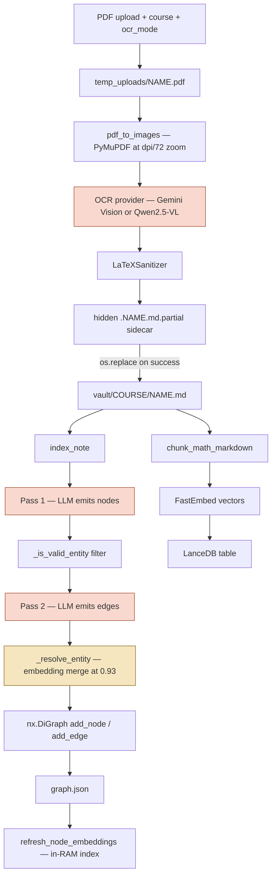
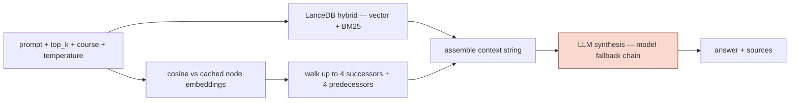

# Data Flow

How data moves through Comeback Helper: what enters, what each stage turns it into, and
what ends up on disk. For *code* structure and call chains see [structure.md](structure.md).

Line references are current as of commit `7726289`.

---

## 1. Entry points

| Entry | Trigger | Does | Indexes? |
|---|---|---|---|
| `POST /api/ingest` | Web dashboard upload | PDF → OCR → vault note → graph + vectors | **Yes** (`auto_index=True`) |
| `POST /api/query` | Dashboard / API | Question → hybrid retrieval → answer | — |
| `POST /api/rebuild/graph` | Dashboard button | Re-extract every vault note | Graph only |
| `POST /api/rebuild/vectors` | Dashboard button | Re-chunk + re-embed every note | Vectors only |
| `python -m src.cli ingest` | Terminal | PDF → OCR → vault note, **stops there** | **No** |
| `python -m src.cli rebuild-graph` | Terminal | Same as `/api/rebuild/graph` | Graph only |
| `python -m src.cli graph-dedupe` | Terminal | Merge duplicate nodes | Rewrites graph |
| `python -m src.cli query` | Terminal | Same as `/api/query` | — |
| `POST /api/clear` | Dashboard | **Destructive** — wipes graph, vault state, LanceDB | — |

Read-only routes: `GET /api/vault`, `/api/graph`, `/api/courses`, `/api/settings`,
`/api/health/ollama`.

> **Asymmetry worth knowing:** the CLI `ingest` command ([cli.py:23](../src/cli.py#L23))
> only runs the OCR pipeline. It never touches the graph or vector store, unlike the API
> route. A note ingested via CLI stays invisible to retrieval until a rebuild runs.

---

## 2. Ingest flow



Orange = LLM (non-deterministic). Yellow = embedding model.

### Stage-by-stage

| # | Stage | Where | In | Out |
|---|---|---|---|---|
| 1 | Upload | [server.py:103](../src/server.py#L103) | `UploadFile`, `course`, `ocr_mode`, `dpi=200` | temp PDF on disk |
| 2 | Rasterise | [pipeline.py:38](../src/ingestion/pipeline.py#L38) | PDF path, dpi | `list[PIL.Image]`, one per page |
| 3 | OCR | provider class | page images | Markdown text with LaTeX |
| 4 | Sanitise | `sanitizer.LaTeXSanitizer` | raw OCR text | normalised `$…$` / `$$…$$` |
| 5 | Write note | [pipeline.py:90-145](../src/ingestion/pipeline.py#L90) | markdown + course | `<vault>/<course>/<name>.md` |
| 6 | Extract nodes | [indexer.py:297](../src/graph/indexer.py#L297) | note text **only** | `list[GraphNode]` |
| 7 | Filter noise | [indexer.py:88](../src/graph/indexer.py#L88) | node names | filtered list |
| 8 | Extract edges | [indexer.py:350](../src/graph/indexer.py#L350) | new names + candidate context + text | `list[GraphEdge]` |
| 9 | Resolve entities | [indexer.py:565](../src/graph/indexer.py#L565) | name + description | canonical id (or unchanged) |
| 10 | Commit | [indexer.py:773-795](../src/graph/indexer.py#L773) | resolved nodes/edges | in-memory `nx.DiGraph` |
| 11 | Persist | [indexer.py:257](../src/graph/indexer.py#L257) | graph | `.storage/graph.json` |
| 12 | Refresh embeddings | [engine.py:83](../src/retrieval/engine.py#L83) | all nodes | `dict[node_id → vector]` in RAM |
| 13 | Chunk | [chunker.py:7](../src/chunker.py#L7) | note markdown | `list[dict]` chunks |
| 14 | Vector index | [store.py:72](../src/vector/store.py#L72) | chunks | LanceDB rows |

**Ordering note:** step 11-12 (graph) runs *before* step 13-14 (vectors) —
[server.py:156](../src/server.py#L156) vs [:173](../src/server.py#L173). A note's own chunks
are therefore not searchable while Pass 2 is asking for linking context.

---

## 3. Data shapes

### `GraphNode` → [schema.py:61](../src/graph/schema.py#L61)

```python
id: str            # defaults to `name` verbatim via populate_id_from_name()
name: str
entity_type: MathEntityType   # Axiom|Definition|Lemma|Theorem|Corollary|
                              # Proof|Formula|Example|Concept
taxonomy: ConceptTaxonomy     # {domain, subdomain, topic}  — free text
aliases: list[str]
description: str
provenance: list[Provenance]
```

> `id = name` is the origin of the duplicate-node problem: identity *is* the display
> string the LLM produced on that call.

### `GraphEdge` → [schema.py:77](../src/graph/schema.py#L77)

```python
source: str        # node id
target: str        # node id
relation: MathRelationType   # USES_AXIOM|USES_DEFINITION|USES_LEMMA|
                             # PROVES|COROLLARY_OF|PREREQUISITE_FOR|DEPENDS_ON
description: str | None      # evidence sentence
provenance: list[Provenance]
```

`PREREQUISITE_FOR(A,B)` is rewritten to `DEPENDS_ON(B,A)` on both write and load
([indexer.py:72](../src/graph/indexer.py#L72)) so inverse pairs can't form fake cycles.

### `Provenance` → [schema.py:28](../src/graph/schema.py#L28)

```python
doc_id, doc_title, doc_path, page_number, section_heading, exact_quote
```

Appended on every index of a note **without dedup** — re-indexing duplicates records.

### Vector chunk row → [store.py:72](../src/vector/store.py#L72)

```python
{"id": str, "text": str, "course": str, "source": str, "vector": list[float]}
```

`source` is the **note filename**, not a concept name. Relevant because
[`_get_candidate_context`](../src/graph/indexer.py#L503) reads this field to fill the
prompt slot labelled "EXISTING KNOWLEDGE BASE CONCEPTS".

### `graph.json` on-disk form

```json
{
  "nodes": [{"id", "label", "type", "description", "taxonomy", "provenance", "aliases"}],
  "edges": [{"from", "to", "source", "target", "relation", "label"}]
}
```

Note the field rename: in-memory `entity_type` is serialised as `type`, and renamed back
on load ([indexer.py:187-193](../src/graph/indexer.py#L187)). Edges carry both
`from`/`to` (vis.js) and `source`/`target` (internal) for the same pair.

---

## 4. Query flow



| # | Stage | Where | In | Out |
|---|---|---|---|---|
| 1 | Chunk search | [store.py:101](../src/vector/store.py#L101) | prompt, top_k, course | chunks `{source, text, course}` |
| 2 | Node match | [engine.py:88](../src/retrieval/engine.py#L88) | prompt | top-3 node ids |
| 3 | Neighbourhood | [engine.py:145-164](../src/retrieval/engine.py#L145) | node ids + graph | `A --[REL]--> B` triples |
| 4 | Assemble | [engine.py:166-181](../src/retrieval/engine.py#L166) | chunks + triples | single context string |
| 5 | Synthesise | [engine.py:187](../src/retrieval/engine.py#L187) | context + question | answer text |

The context string has two labelled sections: `### Semantic Vector Chunks:` and
`### Math PropertyGraph Nodes & Relations:`.

**Model fallback chain** (both extraction and synthesis):
`gemini-3.6-flash` → `gemini-flash-latest` → `gemini-flash-lite-latest` → Ollama
(`llama3.2` → `qwen2.5:3b` → `phi3:mini`) → deterministic block parser (extraction only).

---

## 5. On-disk artifacts

| Path | Written by | Contains | Rebuildable? |
|---|---|---|---|
| `<vault>/<course>/*.md` | [pipeline.py:145](../src/ingestion/pipeline.py#L145) | OCR'd notes, YAML frontmatter | **No** — re-OCR costs money and re-rolls transcription |
| `.storage/graph.json` | [indexer.py:257](../src/graph/indexer.py#L257) | nodes + edges | Yes, from vault (LLM cost) |
| `.storage/vault_state.json` | [manager.py:52](../src/vault/manager.py#L52) | `{abs_path: sha256}` | Yes |
| `.storage/lancedb/` | [store.py:72](../src/vector/store.py#L72) | chunk vectors + BM25 index | Yes, cheap (local embeddings) |
| `.storage/logs/` | [logger.py](../src/logger.py) | Loguru output | — |
| `.storage/temp_uploads/` | [server.py:125](../src/server.py#L125) | in-flight PDFs, deleted in `finally` | — |

The vault is the only irreplaceable artifact. Everything else derives from it.

### Incremental tracking

`vault_state.json` maps **absolute path → SHA-256**
([manager.py:62](../src/vault/manager.py#L62)). `build_or_update_index` skips notes whose
hash is unchanged unless `force=True`.

> Because the key is the path, `Lecture notes 7 to 9.md` and `Lecture notes 7 to 9 (1).md`
> are two documents — a re-download with a browser suffix is ingested as new, producing a
> parallel set of concepts for the same content.

---

## 6. Where data becomes uncertain

Three stages are non-deterministic; everything else is reproducible.

| Stage | Actor | What it decides | Stability risk |
|---|---|---|---|
| OCR (3) | VLM | the text itself | Same page can transcribe differently between runs |
| Pass 1 (6) | LLM | **node identity**, entity type, taxonomy | No view of the existing graph → re-coins names it has already used |
| Pass 2 (8) | LLM | which edges exist, of what type | Candidate context is mostly note filenames |
| Resolution (9) | Embeddings | which nodes are the same | One global 0.93 threshold; never reads the `aliases` it writes |

Steps 6 and 8 are the ones to change. See
[the ownership analysis](https://claude.ai/code/artifact/cafb1aa9-ec0d-497a-8e96-3e67448d3df6)
for why: the values that must stay stable across notes are owned by the least stable actor.

---

## 7. Maintenance paths

| Path | Trigger | Persists? |
|---|---|---|
| `dedupe_graph()` [indexer.py:627](../src/graph/indexer.py#L627) | **Manual CLI only** — nothing in ingest calls it | Only if caller invokes `save_graph()` ([cli.py:144](../src/cli.py#L144)) |
| Load-time self-heal [indexer.py:176](../src/graph/indexer.py#L176) | Every process start | **In memory only** — reaches disk only when something later saves |
| `clear_graph()` [indexer.py:243](../src/graph/indexer.py#L243) | Not routed | Truncates `graph.json` + clears state |

The load-time self-heal applies snake_case→Title-Case redirects, normalises
`taxonomy.domain` casing, and drops legacy `CONTAINS` edges. Because it doesn't write
back, the same repair is recomputed on every startup and `graph.json` stays dirty.
