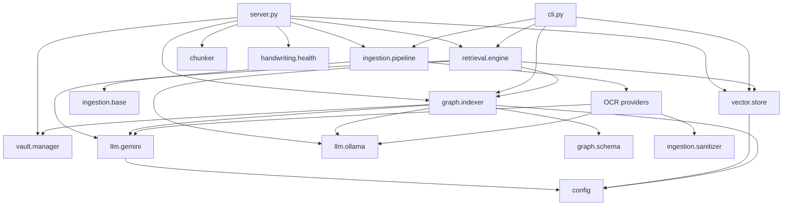

# Code Structure

Module layout, dependency direction, and who calls whom for what. For how *data* moves and
what shape it takes, see [flow.md](flow.md).

> **Paths in this document predate the service split.** The modules described below now live
> under `services/<service>/app/` with one copy each, and `src/` holds only `server.py`,
> `cli.py` and `wiring.py`. The call chains, responsibilities and defects are unchanged —
> only the paths moved. Mapping: `src/graph/*` → `services/graph/app/`,
> `src/vector/*` + `src/chunker.py` → `services/vector/app/`, `src/retrieval/*` →
> `services/retrieval/app/`, `src/vault/manager.py` → `services/vault/app/`,
> `src/ingestion/*` → `services/ingestion/app/`, `src/{config,logger}.py` + `src/llm/*` →
> `services/shared/`. See [../services/README.md](../services/README.md).

Line references are current as of commit `7726289`.

---

## 1. Layout

```
src/
├── server.py          FastAPI app, all HTTP routes, singleton lifespan   (444 L)
├── cli.py             Click commands — a second, thinner front door      (156 L)
├── config.py          Pydantic Settings, .env, cached via lru_cache       (55 L)
├── logger.py          Loguru setup                                        (39 L)
├── chunker.py         Math-aware Markdown splitter (pure function)       (102 L)
│
├── ingestion/         PDF → Markdown
│   ├── base.py                BaseOCRProvider ABC
│   ├── pipeline.py            orchestrator: rasterise → OCR → vault      (151 L)
│   ├── gemini_ocr.py          Gemini Vision, 3-page batches, 4s pacing   (169 L)
│   ├── handwriting_provider.py  local Qwen2.5-VL provider                 (70 L)
│   ├── local_ocr.py           LightOnOCRProvider        [config-only]     (82 L)
│   ├── marker_provider.py     MarkerOCRProvider         [config-only]     (87 L)
│   ├── sanitizer.py           LaTeXSanitizer                              (38 L)
│   └── handwriting/           local VLM sub-pipeline
│       ├── preprocessor.py    ImagePreprocessor
│       ├── ollama_vlm.py      OllamaVisionOCR
│       ├── reassembler.py     ContextualReassembler
│       ├── progress.py        GranularProgressLogger
│       ├── health.py          OllamaHealthCheck
│       ├── segmenter.py       [UNREFERENCED]                            (162 L)
│       └── ocr_engine.py      [UNREFERENCED]                            (114 L)
│
├── graph/             Markdown → knowledge graph
│   ├── schema.py      Pydantic models + enums                            (95 L)
│   └── indexer.py     MathGraphIndexer — extraction, resolution, I/O    (818 L)
│
├── vector/
│   └── store.py       LocalVectorStore — LanceDB + FastEmbed + BM25     (164 L)
│
├── retrieval/
│   └── engine.py      MathQueryEngine — hybrid RAG                      (251 L)
│
└── vault/
    ├── manager.py     ObsidianVaultManager — notes + SHA-256 state       (77 L)
    └── state.py       VaultStateTracker  [DEAD — superseded]             (45 L)
```

`static/` holds the vis.js dashboard. `tests/` holds unit tests. `src/atlas/` contains
**only stale bytecode** — see [§6](#6-dead-and-unwired-code).

---

## 2. Dependency direction



Clean layering, one wrinkle: **`retrieval` depends on `graph`**
([engine.py:9](../src/retrieval/engine.py#L9)) — the query engine holds a
`MathGraphIndexer` to traverse the graph, so it is not purely a read-side component.

`config.py` and `logger.py` are leaves everything imports. `get_settings()` is
`lru_cache`d ([config.py:52](../src/config.py#L52)), so `Settings` is effectively a
process-wide singleton.

---

## 3. Object wiring

Three heavy objects are created **once** at server startup, in dependency order
([server.py:23-45](../src/server.py#L23)):

```python
vector_store = LocalVectorStore()                                   # loads FastEmbed model
graph_indexer = MathGraphIndexer(vector_store=vector_store)         # loads graph.json
query_engine  = MathQueryEngine(graph_indexer=..., vector_store=...)  # embeds all nodes
```

They are stashed on `app.state` and shared by every request. This matters:

- **The graph lives in RAM.** `app.state.graph_indexer.graph` is the live `nx.DiGraph`;
  `graph.json` is a snapshot written by `save_graph()`. In-memory changes not followed by
  a save are lost on restart.
- **`MathGraphIndexer` needs the vector store.** Without it, `_resolve_entity` returns the
  name unchanged ([indexer.py:580](../src/graph/indexer.py#L580)) and entity resolution
  silently does nothing. The server always wires it; the CLI does so only in
  `rebuild-graph` and `graph-dedupe` — see the comment at
  [cli.py:120-123](../src/cli.py#L120) recording the bug this caused.
- **Node embeddings are cached in the engine**, refreshed by
  `refresh_node_embeddings()` after every graph write.
- **`POST /api/clear` outlives its singletons.** It `rmtree`s the LanceDB directory
  ([server.py:429](../src/server.py#L429)) while `app.state.vector_store` still holds an
  open handle to the deleted table. The store is not re-created, so vector writes after a
  clear hit a stale object until the process restarts.

### CLI wiring differs per command

| Command | Constructs | Vector store wired? |
|---|---|---|
| `ingest` | `IngestionPipeline()` | n/a — no indexing at all |
| `query` | `MathQueryEngine()` | Yes, self-constructed internally |
| `graph-stats` | `MathGraphIndexer()` | No — read-only, fine |
| `graph-preview` | `MathGraphIndexer()` | No — dry run, no resolution |
| `rebuild-graph` | `MathGraphIndexer(vector_store=...)` | **Yes** |
| `graph-dedupe` | `MathGraphIndexer(vector_store=...)` | **Yes** — required |

CLI imports are function-local (e.g. [cli.py:27](../src/cli.py#L27)) to keep startup fast;
`--help` doesn't load FastEmbed or NetworkX.

---

## 4. Call chains

### Ingest — `POST /api/ingest`

```
ingest_pdf()                                        server.py:103
├── HandwritingOCRProvider() | GeminiOCRProvider()   server.py:132-139   pick engine
├── IngestionPipeline(ocr_provider=…)                server.py:142
│   └── .process_pdf(pdf_path, course_name)          pipeline.py:57
│       ├── .pdf_to_images(path, dpi)                pipeline.py:38      PyMuPDF
│       ├── provider.process_pdf_direct()            pipeline.py:103     if supported
│       ├── provider.process_image(s)                                    per page/batch
│       │   └── LaTeXSanitizer                       sanitizer.py        normalise math
│       └── os.replace(work_path, target_path)       pipeline.py:145     atomic commit
│
├── graph_indexer.index_note(path, use_llm=True)     server.py:156
│   ├── .extract_from_text()                         indexer.py:522
│   │   ├── ._extract_nodes_pass()                   indexer.py:297      LLM call 1
│   │   ├── _is_valid_entity()                       indexer.py:88       regex filter
│   │   ├── ._extract_edges_pass()                   indexer.py:350      LLM call 2
│   │   │   └── ._get_candidate_context()            indexer.py:503      linking context
│   │   │       └── vector_store.search_similar()    store.py:101
│   │   └── ._block_extraction()                     indexer.py:416      fallback only
│   ├── ._resolve_entity(name, description)          indexer.py:565      per node + endpoint
│   │   └── vector_store.embed_texts()               store.py:136        called in a loop
│   └── _normalize_relation()                        indexer.py:72
│
├── graph_indexer.save_graph()                       server.py:157  →  indexer.py:257
├── query_engine.refresh_node_embeddings()           server.py:161  →  engine.py:83
│
├── chunk_math_markdown(content, course, source)     server.py:167  →  chunker.py:7
└── vector_store.add_chunks(chunks)                  server.py:173  →  store.py:72
```

### Query — `POST /api/query`

```
query_knowledge_base()                              server.py:207
└── query_engine.query(prompt, top_k, …)            engine.py:187
    ├── .retrieve_context()                         engine.py:115
    │   ├── vector_store.search_similar(hybrid)     store.py:101     BM25 + vector
    │   ├── ._find_similar_nodes(prompt, top_k=3)   engine.py:88     vs cached embeddings
    │   └── graph.neighbors() / .predecessors()     engine.py:153-159  ≤4 each
    └── get_gemini_client() → candidate loop        gemini.py:46
        └── get_ollama_client() fallback            ollama.py:160
```

### Startup — every process

```
MathGraphIndexer.__init__()                         indexer.py:152
├── ._load_graph()                                  indexer.py:176
│   ├── _snake_case_redirects()                     indexer.py:45    fold foo_bar → Foo Bar
│   ├── normalize_domain_casing()                   schema.py:37     taxonomy casing
│   ├── drop relation == "CONTAINS"                 indexer.py:225   retired edge type
│   └── _normalize_relation()                       indexer.py:72
└── ObsidianVaultManager(vault_path, state_file)    manager.py:20
```

All four repairs run **in memory**. They only reach disk if something later calls
`save_graph()`.

---

## 5. Module reference

### `MathGraphIndexer` — [graph/indexer.py](../src/graph/indexer.py)

The largest and most active module. Four responsibilities that could reasonably be
separate: extraction, entity resolution, persistence, and vault iteration.

| Method | Line | Called by | For |
|---|---|---|---|
| `_load_graph` | 176 | `__init__` | read + self-heal `graph.json` |
| `save_graph` | 257 | server, cli, `build_or_update_index` | persist |
| `clear_graph` | 243 | `POST /api/clear` | wipe graph + vault state |
| `_extract_nodes_pass` | 297 | `extract_from_text` | LLM pass 1 |
| `_extract_edges_pass` | 350 | `extract_from_text` | LLM pass 2 |
| `_block_extraction` | 416 | `extract_from_text` | deterministic fallback |
| `_get_candidate_context` | 503 | `_extract_edges_pass` | existing-concept context |
| `extract_from_text` | 522 | `index_note`, `cli graph-preview` | run both passes |
| `_resolve_entity` | 565 | `index_note` | merge synonyms |
| `dedupe_graph` | 627 | **`cli graph-dedupe` only** | retro-merge duplicates |
| `index_note` | 745 | server ingest, `build_or_update_index` | one note → graph |
| `build_or_update_index` | 801 | `/api/rebuild/graph`, `cli rebuild-graph` | whole vault |

Module-level helpers `_snake_case_redirects` (45), `_normalize_relation` (72) and
`_is_valid_entity` (88) are pure functions — the easiest place to add deterministic
normalisation.

### `MathQueryEngine` — [retrieval/engine.py](../src/retrieval/engine.py)

| Method | Line | Notes |
|---|---|---|
| `_build_node_embeddings` | 63 | embeds `"{id}: {description}"` for every node at init |
| `refresh_node_embeddings` | 83 | called after every graph write |
| `_find_similar_nodes` | 88 | cosine vs the cached index |
| `retrieve_context` | 115 | vector chunks + graph triples → one string |
| `query` | 187 | prompt template + model fallback chain |

> **Duplicated work:** this cached node index is exactly what `_resolve_entity` and
> `dedupe_graph` recompute from scratch, per call, inside a loop. Consolidating them is
> the cheapest available performance win.

### `LocalVectorStore` — [vector/store.py](../src/vector/store.py)

`add_chunks` (72), `search_similar` (101, `query_type="hybrid"` = BM25 + vector),
`embed_texts` (136, used by the graph indexer for entity resolution), `get_stats` (147).
Table auto-creates with a dummy `init.md` row (48-55) — filtered out in
`_get_candidate_context`.

### `ObsidianVaultManager` — [vault/manager.py](../src/vault/manager.py)

`get_all_notes` (25, `rglob("*.md")`), `extract_wikilinks` (31),
and SHA-256 state tracking keyed on **absolute path** (62-69).

### LLM clients — [llm/](../src/llm)

`get_gemini_client()` returns `None` when no API key is set, which is what triggers the
Ollama fallback everywhere. `get_gemini_candidate_models()` supplies the retry chain used
identically by extraction and synthesis.

---

## 6. Dead and unwired code

| Item | Status | Evidence |
|---|---|---|
| `src/atlas/` | **Not on `main`** | Only `__pycache__/` + `lattice/data/`. Belongs to branch `atlas-model-b` ("Replace concept graph with the atlas model"); working-directory residue. `.storage/atlas.json` likewise. |
| ~~`vault/state.py` `VaultStateTracker`~~ | **Deleted** | Was never imported; duplicated `ObsidianVaultManager`'s state methods. Removed. |
| `handwriting/segmenter.py`, `handwriting/ocr_engine.py` | **Unreferenced** | Only import each other. The live provider uses whole-page VLM, not region segmentation. 276 lines. |
| `local_ocr.py`, `marker_provider.py` | **Config-only** | Reachable via `OCR_PROVIDER=local|marker` ([pipeline.py:24-32](../src/ingestion/pipeline.py#L24)) but not from the dashboard's `ocr_mode` field. |
| `MathEntityExtraction` | Vestigial | The 1-pass schema; only `_block_extraction` still returns it. |
| "KùzuDB" in `/api/clear` docstring | Stale | [server.py:418](../src/server.py#L418) names a database this codebase doesn't use. |
| `/api/graph` wikilink fallback | Second graph builder | [server.py:284-325](../src/server.py#L284) builds a note→wikilink graph if `graph.json` is missing or empty — a completely different node model from the indexer's. |

---

## 7. Where to change things

| Goal | Touch |
|---|---|
| Change what counts as an entity | `PASS1_NODE_PROMPT` [indexer.py:105](../src/graph/indexer.py#L105) + `_is_valid_entity` [:88](../src/graph/indexer.py#L88) |
| Change relation vocabulary | `MathRelationType` [schema.py:18](../src/graph/schema.py#L18) + `PASS2_EDGE_PROMPT` [indexer.py:120](../src/graph/indexer.py#L120) + `_normalize_relation` [:72](../src/graph/indexer.py#L72) |
| Fix node identity | `GraphNode.populate_id_from_name` [schema.py:70](../src/graph/schema.py#L70) — add a normalised key alongside the display name |
| Improve linking context | `_get_candidate_context` [indexer.py:503](../src/graph/indexer.py#L503) — currently returns note filenames |
| Make dedup automatic | Call `dedupe_graph()` from `index_note` or `build_or_update_index` |
| Persist the self-heal | `save_graph()` after `_load_graph()` when redirects fired |
| Add an OCR provider | Subclass `BaseOCRProvider`, register in [pipeline.py:24-32](../src/ingestion/pipeline.py#L24) |
| Change chunking | `chunk_math_markdown` [chunker.py:7](../src/chunker.py#L7) — pure function, easy to test |
| Add a retrieval signal | `retrieve_context` [engine.py:115](../src/retrieval/engine.py#L115) |
